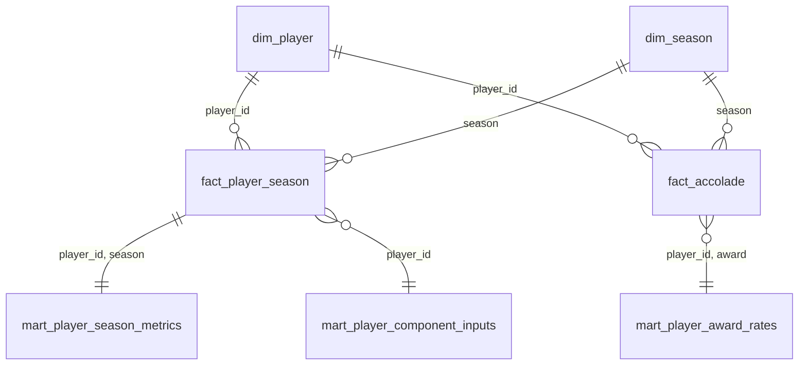

# Data Model — Star Schema and Transform Layer (T6)

The SQL layer (`sql/01`–`04`, `06`) turns the cleaned, contract-validated seed tables into a
star schema plus the raw inputs each `docs/methodology/v1.md` §5 scoring component needs.
It deliberately stops **before** scoring: no min–max scaling, no weights, no final scores —
everything here is objective-layer (v1.md §1). Scoring is T7's `sql/05_final_goat_scores.sql`
(one implementation for career scope, peak scope, and Custom Mode), driven by
`pipeline/score.py`, which injects the weighting layer from `config/scoring_v1.yaml`, guards
the output, and stamps provenance; `pipeline/compare.py` derives pairwise verdicts from the
scored table (v1.md §6 — no separate math).

Run it with `make transform` (clean → contracts → transform → validation checks →
`data/marts/`, gitignored and regenerable). `pipeline/transform.py` enforces the
validate-before-transform order itself — it runs the Pandera contracts on its input frames
and refuses to execute SQL against anything invalid — and injects every tunable value from
config (validated for key parity, finiteness, and bounds) — nothing in the SQL is hardcoded
that the methodology calls a parameter.

## The two-minute grain explanation

- **`dim_player`** — one row per seeded player (20). The "who".
- **`dim_season`** — one row per league season, 1957–2026 (70), end-year convention
  (1961-62 → 1962). The "when", carrying each season's league environment: pace, per-game
  baselines, schedule length, whether an All-Star Game was held.
- **`fact_player_season`** — one row per player per season (335), the analysis grain.
  Regular-season and playoff stat splits side by side. Key `(player_id, season)`.
- **`fact_accolade`** — one row per player per season per award won (668), season-attributed
  so the peak scope can slice awards by window. Key `(player_id, season, award)`.
- **Marts** — analysis-ready outputs derived from the facts:
  `mart_player_season_metrics` (per-season era-relative metrics, 335),
  `mart_player_component_inputs` (per-player raw component values, 20),
  `mart_player_award_rates` (per-player per-award rates, 120 = 20 × 6),
  `mart_final_scores` (T7: one row per player per scored run — six 0–100
  component scores, the final GOAT score, and the §6 rank; peak-scope runs
  carry no longevity column because §7 drops that component).

Facts and dims stay normalized (joins go through keys); marts may denormalize `player_name`
for legibility because they are what the report reads.

## Column traceability (mart → v1.md formula)

Every derived column is traceable to a methodology section; the hand worksheet
(`docs/methodology/v1_hand_worksheet.md`) verifies the whole chain on the locked fixture trio
(`tests/unit/test_transforms.py`). One documented blind spot: every trio career is shorter than
`peak_n`, so the worksheet and golden snapshot cannot numerically pin top-5 **window sizing**
itself — that is pinned by the seven-season pools in `tests/unit/test_transforms.py` and the
end-to-end seven-season scoring test in `tests/unit/test_scoring_invariants.py`, while any
config-value drift in `peak_n` is caught structurally by the golden config hash.

### `dim_season` (built in `sql/02_staging.sql`)

| column | formula | v1.md |
|---|---|---|
| `base_pts/trb/ast` | `(lg_*_pg / pace × 75) / 5` — league per-75 baseline per player-slot | §3 step 2 |

### `mart_player_season_metrics` (built in `sql/03_player_season_metrics.sql`)

| column | formula | v1.md |
|---|---|---|
| `poss` | `mp × pace / 48` (league pace, uniform across eras) | §3 step 1 |
| `per75_pts/trb/ast` | `stat / poss × 75` | §3 step 1 |
| `rel_pts/trb/ast` | `per75 / base` — 1.0 = league-average per possession-slot | §3 step 2 |
| `spi` | `.50·rel_pts + .25·rel_trb + .25·rel_ast` (blend from config) | §4 |
| `avail` | `min(1, gp / season_games)` — schedule-length aware | §4 |
| `ts`, `rel_ts` | `pts / (2·(fga + 0.44·fta))`; `ts / lg_ts_pct` | §3 |
| `po_poss`, `p_rel_*`, `p_spi` | identical treatment on playoff totals, same regular-season baselines; **null iff the postseason was missed** | §4, §9, §12.10.2 |
| `qualifies_peak` | `avail ≥ 0.5` (config `peak_min_avail`) | §5.1, §12.5 |
| `peak_fallback` | true iff the player has zero qualifying seasons (all become eligible; never fires on the real seed — min qualifying count is 11) | §5.1 |
| `peak_rank` | `ROW_NUMBER` over eligible seasons by SPI desc, earlier season first | §5.1 |
| `is_peak_window` | `peak_rank ≤ 5` (config `peak_n`); fewer eligible than N → all | §5.1 |
| `spi_rank_pool` | `RANK` of the season's SPI across the whole pool | report input |

### `mart_player_component_inputs` (built in `sql/04_scoring_components.sql`)

Raw values only — T7 applies §6 min–max scaling and the weighting layer.

| column | formula | v1.md |
|---|---|---|
| `peak_raw` | mean SPI over the peak window | §5.1 |
| `longevity_raw` | `Σ avail × spi` over all seasons | §5.2 |
| `ws48` | `Σ ws / Σ mp × 48` | §5.3 |
| `srs_w` | `Σ gp × team_srs / Σ gp` (traded seasons pre-weighted in the seed) | §5.3 |
| `playoff_raw` | `Σ p_spi × po_gp`, missed postseasons contribute 0 (`COALESCE`) | §5.4 |
| `rel_ts_career` | `Σ mp × rel_ts / Σ mp` | §5.6 |
| `spi_career` | `Σ mp × spi / Σ mp` | §5.6 |

### `mart_player_award_rates` (built in `sql/04_scoring_components.sql`)

| column | formula | v1.md |
|---|---|---|
| `eligible_seasons` | played seasons with `season ≥ award intro` (config); All-Star also requires `asg_held` (1999 excluded) | §5.5 |
| `weighted_wins` | selections passing the **same eligibility predicate as the denominator** (an ineligible selection can never inflate a rate); All-NBA 1st/2nd/3rd = 1.0/0.5/0.25 (config) | §5.5 |
| `rate` | `weighted_wins / eligible_seasons`; **null when zero eligible seasons** — the award is excluded from that player's mix and T7 renormalizes the remaining award weights | §5.5, §12.7 |

On the real seed, the null-rate case is exercised by DPOY for exactly Wilt Chamberlain,
Jerry West, Bill Russell, and Oscar Robertson (retired before 1983) — the Bill Russell worked
example of v1.md §12.7, reproduced mechanically.

### `mart_final_scores` (built in `sql/05_final_goat_scores.sql`, T7)

| column | formula | v1.md |
|---|---|---|
| `comp_peak/longevity/playoff` | `MM(raw)` — `100·(x−min)/(max−min)` across the pool; a zero or noise-thin pool range is REFUSED as invalid input rather than scored (peak scope exempts the dropped longevity input) | §6, §9, ADR-0002 |
| `comp_winning_impact` | `.50·MM(ws48) + .50·MM(srs_w)` (blend from config) | §5.3 |
| `comp_efficiency` | `.50·MM(rel_ts_career) + .50·MM(spi_career)` (blend from config) | §5.6 |
| `comp_accolades` | `Σ w_a·MM(rate_a) / Σ w_a` over the player's **eligible** awards — null rates excluded, weights renormalized; an exact pool-wide rate tie scores 50.0 (the §6 degenerate rule applies to award-rate elements only) | §5.5, §12.7 |
| `goat_score` | `Σ w_c · comp_c`, weights injected per scope (peak: longevity dropped, others ÷ (1−w_longevity)) | §6–§8 |
| `rank` | `ROW_NUMBER` over score desc, Peak desc, player_id asc — a total order, so ranks are unique 1..N | §6 |
| `scope`, `method_version`, `git_sha` | provenance stamped by `pipeline/score.py` (echoed from config / `git rev-parse`) | §10.6 |

## Scope: one engine, many configurations (v1.md §7, §12.9)

`sql/04` aggregates behind a single filter, selected by the injected `scope` parameter:
career scope (default) admits all seasons; peak scope restricts every aggregation — playoff
sums, award eligibility, award wins — to the §5.1 peak window flagged in
`mart_player_season_metrics`. Peak Mode in T7 is therefore the same SQL with one variable
flipped, not a second code path.

## Validation (`sql/06_validation_checks.sql`)

Named zero-row checks, raised loudly by `pipeline/transform.py`: mart row counts reconcile
against the staged inputs (never hardcoded totals, so the same file validates the synthetic
fixture pool), playoff metrics null exactly when the postseason was missed, no NaN/inf in any
derived column, availability and rates in bounds, peak windows sized `min(peak_n, eligible)`,
zero-eligible awards null, the whole award-rate mart reconciled EXACTLY against an
independently re-derived player × award grid — keys in both directions, eligibility
denominators, and weighted wins, so a partial win loss, a ghost row, or a corrupted
denominator is caught, not just a fully dropped award — and every rate equal to its own
`weighted_wins / eligible_seasons` definition. Contracts (`pipeline/contracts.py`) guard the
input shape; these guard what the SQL derived from it.

## Known, documented properties (not bugs)

- **Pool-relative outputs.** Downstream min–max scaling (T7) is relative to this 15–30 player
  pool; adding or removing a seed player moves everyone's scaled scores (v1.md §12.2).
  Nothing in this layer depends on the pool, but its consumers do.
- **Small-sample playoff runs.** v1.md §5.4 has no playoff-minutes qualifier, so a cameo run
  can carry an outsized per-possession rate: Jerry West's 1967 postseason (1 game, 1 minute,
  1 rebound) grades P_SPI ≈ 1.05. The contribution is bounded by construction —
  `p_spi × po_gp` adds ~1.05 of his 206.6 career playoff raw (~0.5%, ≈0.05 final GOAT points).
  Both ends are regression-tested: the cameo's per-season P_SPI in the transform suite, and
  the end-to-end final-score effect in T7 (`test_west_cameo_marginal_impact`: removing only
  the cameo moves West's final score by 0.05217 and leaves every other row bit-identical). A
  minimum-minutes qualifier would be a behavior-changing v2 decision, not a transform-layer
  fix.
- **Era-gated stats ride along unscored.** `fg3m/fg3a`, `stl/blk`, `tov` are in
  `fact_player_season` for the data dictionary and report, with their era nulls intact; v1
  scoring never reads them (v1.md §4, §12.10.4).
